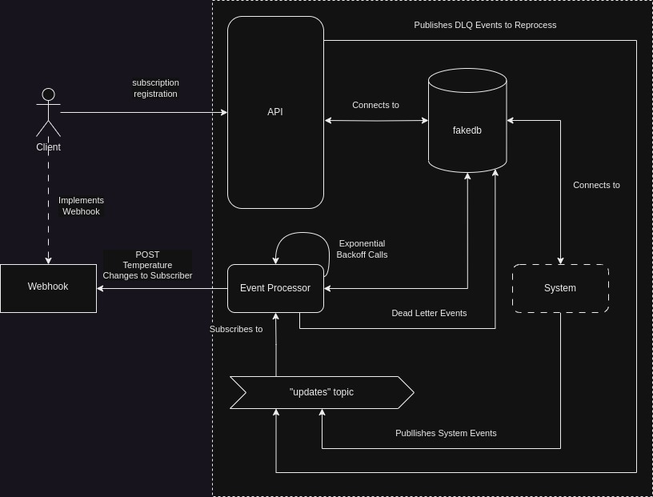

# webhook-sample
Webhook Sample

This sample creates a simple asynchronous API sample to register a webhook and receive temperature changes. The system is abstracted by and internal topic and a scheduler component.

# Solution Design



# TODO

This is a sample implementation. There are several upgrades to-do:

- Multi threading and production grade performance improvements;
- Webhook Security: Oauth-2 key registration and authorization for POST CALLs;
- DLQ: DLQ and Reprocessing API.

# Pre-reqs

- GNU Make
- Poetry
- Python 3.11+
- PyEnv

# Installation

```
poetry install
```

# Starting infrastructure

You'll need a local Kafka broker to test this sample. Run the following command:

```
make infra-start
```

# Starting the API

To run the API

```
make run-api
```

Then test it:

```
http://localhost:9090/docs
```

There is already a subscriber registered to the service, which will run on the following URL `http://localhost:9099`


# Running the System Tasks

This component is an abstract representation of the system, which will do the business thing and publishes messages to notify the subscribers. 

```
make run-system
```

# Running the Worker

The worker is the component will receive the messages from the internal topic and will provide the webhook updates to the customers.

```
make run-worker
```

# Stopping infra


Stop the kafka local broker.

```
make infra-stop
```
